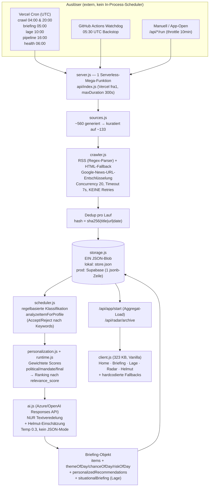

# Helmut – Technisches Audit des Datenmotors

> **⚠️ ÜBERHOLT (Stand 2026-07-16).** Dieser Bericht vom 2026-07-01 beschreibt einen
> Vor-V3-/Single-Tenant-Zustand und referenziert Dateien, die es heute nicht mehr gibt
> (`personalization.js`/`runtime.js`/`briefing.js`). Er ist **nur noch historischer
> Kontext**. Der verbindliche, gegen Code + Production-DB geprüfte Auditstand ist
> `docs/helmut_datenmotor_audit.md` (+ `…_umsetzungsplan.md`, `…_thread2_handoff.md`).
> Nicht mehr für Betrieb/Due-Diligence heranziehen.

**Rolle:** Externer CTO / Due-Diligence vor Investment
**Datum:** 2026-07-01
**Scope:** Datenmotor (Quellen → Crawl → Speicherung → KI → Priorisierung → Lage/Radar/Helmut → Frontend)
**Modus:** Nur Analyse. Kein Code geändert. Keine Optimierung umgesetzt.
**Basis:** Vollständige Lektüre von `lib/helmut/*` (crawler, sources, dip, ai, learning, storage, personalization, scheduler, runtime, accounts, auth, push), `server.js` (2665 Z.), `api/index.js`, `vercel.json`, `supabase/schema.sql`, `.github/`, sowie Analyse des Live-Datenspeichers `.helmut-data/store.json` (2,1 MB, 1 Profil).

> **Wichtiger Kontext vorweg:** Helmut ist heute ein **Single-Tenant-Pilot für genau einen Abgeordneten** (den Pilotmandanten; dessen Partei und Ausschussdomäne prägen die gesamte Konfiguration). Das ist keine Randnotiz – es prägt jede Bewertung unten. Vieles ist „multi-tenant-förmig" gebaut, aber auf diesen einen Mandanten hart verdrahtet.

---

## 1. Gesamtarchitektur & Datenfluss

**Kurzfassung des Flusses:** Externer Cron ruft HTTP-Endpunkte → eine einzige Serverless-Funktion crawlt ~133 Quellen (überwiegend Google-News-RSS) → dedupt pro Lauf → schreibt alles in **einen JSON-Blob** → eine **regelbasierte Engine** klassifiziert und scored → die **KI veredelt nur die Formulierung** und schreibt die „Helmut"-Einschätzung → alles wird zurück in denselben Blob geschrieben → das Frontend lädt ein Aggregat.

**Zentrale Wahrheit:** Der „KI-Datenmotor" ist zu ~90 % ein **regelbasiertes Keyword-Scoring-System**. Das LLM entscheidet nichts über Wichtigkeit/Chance/Risiko – es formuliert nur schöner.

---

## 2. Datenquellen

**133 aktive Quellen** (nach Kuratierung von ~560). Sie sind vollständig **im Code hartkodiert** (`sources.js`), es gibt keine DB-gepflegte Quellenliste. Verteilung nach Typ:

| Typ | Anzahl | Beispiele |
|---|---|---|
| committee (Ausschüsse) | 49 | Ausschuss Arbeit & Soziales (HTML), 22 Bundestagsausschüsse |
| media | 31 | Tagesschau, Deutschlandfunk, 23 Medien + 16 breite Medien |
| association | 17 | DGB (HTML), Sozialverbände |
| official | 13 | Behörden-Suchen |
| ministry | 9 | BMAS, Bundesregierung |
| bundestag | 7 | Bundestag, Fraktionen |
| local | 4 | Regional/Wahlkreis |
| party | 2 | Partei des Pilotmandanten, zugehörige Fraktion |
| person | 1 | Personen-News-Suche des Pilotmandanten (`<pilot-mandats-id>-news`) |

**Pro Quelle gespeichert:** `id, name, type, url, rssUrl, rssUrls[], crawlMethod (rss/html), priority, active, maxItems, lastCrawledAt`. **Keywords/Filter sind in die Google-News-Query-Strings eingebacken**, nicht als Feld.

- **RSS vs. API:** 131 RSS, 2 HTML-Scrape. **Keine echte API** außer der optionalen DIP-Integration (s. u.). Ein sehr großer Teil sind **Google-News-RSS-Suchen** (`news.google.com/rss/search?q=…`) – d. h. Helmut hängt an einem einzigen, inoffiziellen, jederzeit kündbaren Aggregator.
- **Abrufintervall:** Nicht pro Quelle konfiguriert. Global über Cron: **Crawl 2×/Tag** (04:00 & 20:00 UTC).
- **Geladene Artikel / letzter Abruf (lokaler Store):** 471 `rawItems`; jüngster erfolgreicher Crawl **30.06. 15:46** (~20 h alt). Von 133 Quellen haben nur **51 überhaupt ein `lastCrawledAt`** (alle aus einem Seed-Batch vom 20.06.), **82 Quellen nie** einen echten Zeitstempel – im lokalen Store nie individuell nachgeführt.
- **Fehler/Timeout:** Timeout 7 s pro Request, **keine Retries**. In den `crawlRuns` sind ganze Läufe mit `getaddrinfo ENOTFOUND` für **alle** Quellen protokolliert (in einer Offline-Umgebung gelaufen, nichts gespeichert). Der jüngste Lauf (30.06.) war sauber.

**Ungenutzte / dormante Quellen & Wege:**
- `crawlMethod: "manual"` – im Crawler behandelt, **von keiner Quelle genutzt** (toter Zweig).
- Das große `deepTopicSources`-Kreuzprodukt (25 Themen × 14 Kontexte = **350 Bündel-Quellen**) wird durch die Kuratierung **fast vollständig weggeworfen** – nur die „· Ausschuss Arbeit und Soziales"-Variante überlebt.
- **DIP (Bundestag) ist NICHT im Crawl-Pipeline verdrahtet** – nur on-demand über `/api/parliament`, und nur aktiv, wenn `DIP_API_KEY` gesetzt ist. Ohne Key: komplett inaktiv (`{enabled:false}`). Das ist die einzige *offizielle, strukturierte* Datenquelle – und sie liegt brach.

---

## 3. Crawler

- **Einsammeln:** `crawlAllSources` → `mapWithConcurrency` (handgeschriebener Worker-Pool, **Concurrency 20**). Pro Quelle: RSS-Feeds versuchen → wenn leer, HTML-Fallback auf die Startseite.
- **RSS-Parser:** **Kein Bibliotheks-Parser, sondern Regex** (`matchAll(/<item…>/)`, Atom-Fallback `<entry>`). Fragil gegenüber ungewöhnlichem XML.
- **Artikel pro Quelle:** `maxItems` – Google News 12, Direkt-RSS 16, Personensuche 40, Themenradar 16. Gesamter Kandidatenpool eines Laufs wird auf **Top 1000** nach `rawCandidateScore` gekürzt.
- **Duplikaterkennung:** `hash = sha256(title | url | date)`, Dedup per `Set` – **aber nur innerhalb eines Laufs**. Cross-Run-Dedup passiert indirekt beim Speichern (`saveRawItems` dedupt per hash gegen den Bestand). Schwäche: Hash hängt am **Titel** – gleicher Artikel mit leicht anderem Titel/Datum = Dublette. Im Store: 471 Items, **nur 121 eindeutige URLs** (viele auf `""` geleert), 444 eindeutige Titel.
- **Löschen/Retention:** Der Crawler löscht nichts. Kappung passiert im Storage (s. §4).
- **Filter:**
  - Keyword-Filter **nur für `person`-Quellen** (Titel/Text muss den Namen enthalten). Alle anderen Quellen bekommen **keinen** Titel/Text-Keyword-Filter beim Crawl.
  - **Keine harte Datumsgrenze** – Alter fließt nur weich ins Scoring (`max(0, 14 - ageInDays)`).
  - Generische-Startseiten-Filter (`isGenericHtmlPage`), URL-Brauchbarkeit (`isUsableArticleUrl` verwirft google/gstatic/Assets).
  - Sprache nur über Google-News-Parameter (`hl=de`).
- **Fehler:** Pro Quelle try/catch → `{ok:false, error}`; ein Ausfall stoppt den Lauf nicht. **TLS-Verifikation ist global abgeschaltet** (`rejectUnauthorized = false`) – ernstes Sicherheits-/Integritätsrisiko (MITM, gefälschte Feeds). Google-News-Auflösung nutzt einen `batchexecute`-POST-Trick, der bei jeder Google-Formatänderung **still** `""` zurückgibt.

---

## 4. Datenbank

**Es gibt keine relationale DB im Betrieb.** Der gesamte Zustand ist **ein JSON-Dokument**:
- **Lokal:** `.helmut-data/store.json` (voll gelesen/geschrieben, `writeFileSync`, **kein Lock, kein temp+rename, keine Atomizität**).
- **Produktion:** Supabase-Tabelle `helmut_store(id text, data jsonb)` – der komplette Store ist **eine einzige jsonb-Zeile**, per Service-Role-Key (RLS wird umgangen).
- **Aufteilung** in 3 Blobs: `main` (Quellen, rawItems, crawlRuns, Profile), `p-{politicianId}` (Inhalte pro MP), separater Auth-Store.

**`supabase/schema.sql` definiert 8 saubere relationale Tabellen** (`political_items`, `personalized_recommendations`, `mandate_profiles`, RLS-Policies …) – **die kein einziger Code-Pfad nutzt.** Sie sind rein aspirational. Genutzt wird **nur** `helmut_store`.

**Gespeicherte Collections (Auszug) & Felder:** rawItems (`title, url, originalUrl, content, excerpt, publishedAt, retrievedAt, hash, sourceType, confidence …`), briefings (riesige Composite-Objekte, ⌀ 244 KB), personalizedRecommendations (`user_id, relevance_score, politicalScore, mandateScore, finalScore, priority`), politicalItems, priorityChanges, topicMemory, interactions, pipelineDebugReports u. a.

**Feld-Naming ist inkonsistent** (technische Schuld): alte Objekte camelCase (`politicianId`), neue snake_case (`user_id, created_at`) – der Code muss beides versöhnen (`item.politicianId ?? item.user_id`).

**Niemals gespeichert:**
- Nicht-direkte Artikel-URLs werden vor dem Speichern auf `""` geleert (`linkType:"missing"`) – Google-Proxy/Asset/Startseiten-Links.
- `homeSections` auf ≤3 pro Sektion getrimmt.
- Push-Crypto-Keys werden bei Export redigiert.
- Volltext der Artikel wird **nicht** verworfen (bleibt in `content/excerpt`).

**Retention:** **Keine zeitbasierte TTL.** Nur Anzahl-Caps pro Mandat, angewandt bei jedem Schreibvorgang (neueste N behalten, Rest fällt raus): briefings 4/Mandat (320 gesamt), interactions 80, topicMemory 120, recommendations 80, pipelineDebugReports 2, rawItems: Personen-Items bis 160 geschützt, allgemein bis 440, Gesamt 600. → **Daten bleiben unbegrenzt lange, bis sie durch neuere verdrängt werden.**

---

## 5. KI-Analyse

**Modell/Provider (dual, Laufzeit-Auto-Detektion):**
- **Azure OpenAI EU** (Vorrang, DSGVO), Deployment default **`gpt-5-mini`** – über OpenAI **Responses API** (`/openai/v1/responses`).
- Fallback OpenAI direkt: `DEFAULT_MODEL = gpt-5.5`, Notfall-Fallback `gpt-4.1`.
- **Temperatur:** global **0.3** (nur für Nicht-Reasoning-Modelle; gpt-5*/o* bekommen stattdessen `reasoning.effort: "minimal"`, keine Temperatur).
- **Kein JSON-Mode** (`response_format` ungenutzt) – JSON wird per Prompt erbeten und **manuell geparst** (Fences strippen, `{…}`-Substring).
- `max_output_tokens`: 900 (Standard) / 2500 (Reasoning). HTTP-Timeout 20 s.

**Es gibt genau 4 LLM-Aufrufe.** Kritisch: **Keiner davon klassifiziert oder priorisiert.** Alle Labels (wichtig/Chance/Risiko/Beobachten/Reagieren/Ignorieren) und alle Scores entstehen **regelbasiert vor** dem LLM. Das LLM formuliert nur.

### Prompt A — `refineBriefingItem` (Textveredelung, Temp 0.3)
> „Du bist Helmut, ein digitaler politischer Stabschef. Du veredelst eine **bereits regelbasiert priorisierte** politische Empfehlung. Regeln: du-Ansprache; keine Fakten erfinden; nur mitgelieferte Quellenbasis; bei schwacher Quelle vorsichtig; maximal konkret; schreibe wie ein Oppositions-Referent (Was plant die Regierung, wo ist die Lücke, was tun?); vermeide generische Wörter; jede Empfehlung muss Ausschuss/Mandatsprofil/Quelle konkret verbinden; **ausschließlich valides JSON**." → Felder: `whyItMatters, whyNow, recommendedAction, inactionConsequence, riskNote, opportunityNote, recommendedPreparation, suggestedStatement`. *Items mit `decision === "Ignorieren"` werden übersprungen.*

### Prompt B — `generateCommunicationDraft` (Kanal-Text, Temp 0.3)
> „Du bist Helmut … Erzeuge einen Kommunikationsvorschlag für den Kanal: `{Presse/LinkedIn/X/Instagram/Ausschussfrage/Bürgerdialog/Interne Linie}`. Länge/Ton/Format je Kanal; keine unbelegten Behauptungen; keine Fakten außerhalb der Quellenbasis; Oppositionslogik; muss nach Mensch klingen …" → `{text, rationale}`. **Einziger Pfad mit Lernprofil-Injektion** (ab ≥5 Interaktionen). *Achtung: einziger LLM-Call ohne try/catch um den API-Aufruf.*

### Prompt C — `assessParliamentaryItem` (DIP-Vorgang, Temp 0.3)
> „…Bewerte kurz diesen offiziellen Bundestags-Vorgang für das Mandat. `whyRelevant`: genau 1 Satz; `recommendedAction`: 1 konkreter Schritt (Stellungnahme/Kleine Anfrage/…)." → `{whyRelevant, recommendedAction}`.

### Prompt D — `generateHelmutAssessment` (die „Handlungsempfehlung", Temp 0.3)
> „Du bist Helmut … kurze persönliche Einschätzung auf Basis eines **bereits priorisierten Briefings**. Lage zeigt Fakten, Helmut trifft eine Entscheidung. Beantworte: ‚Hat sich meine Priorität geändert?' Max 120–180 Wörter; du-Ansprache; keine Spekulation; keine Fakten außerhalb des Kontexts. Hero-Felder mit harten Wortlimits …" → `{greeting, priorityStatus (stable|changed|risk|chance), assessment, recommendation, whyImportant, risk, heroWhy, heroRisk, heroNextStep, typingText}`. *Der Vorname des Pilotmandanten ist im Prompt-Beispiel hart verdrahtet.*

**Output/Kosten/Dauer:** Der `usage`-Block der API wird **nie gelesen**. **Es gibt kein Token-, Kosten- oder Latenz-Tracking.** Kein Timing um LLM-Calls. Bei 500 Mandanten wäre die KI-Ausgabe **komplett blind** – ein finanzielles Blindflug-Risiko.

**Welche Kriterien entscheiden wirklich (regelbasiert, in `personalization.js`/`runtime.js`):**
- **decision-Enum** aus `relevanceToScore`: Kritisch/Hoch → **„Sofort reagieren"** (Reagieren), Mittel bzw. regierungs-zeitkritisch → **„Beobachten"**, sonst → **„Ignorieren"**.
- **Chance vs. Risiko:** getrennte Sub-Scores `opportunityScore`/`chanceScore` vs. `riskScore`/`conflictScore`, gespeist aus Keyword-Treffern (Chance: „gesetz, eckpunkte, initiative, fordert"; Risiko: „kritik, angriff, warnt, vorwurf").
- **Wichtig/Unwichtig:** finaler `relevance_score`; **Cutoff < 35 = raus**, Home-Sektionen erst ≥ 40. Buckets: ≥90 „Sofort handeln", ≥80 „Kritisch", ≥60 „Wichtig", ≥40 „Relevant", sonst „Beobachten/Ignorieren".

**Lernschleife (`learning.js`):** Echtes, zeitlich abklingendes Präferenz-Weighting (Topics/Quellen/Aktionen/Keywords; Gewichte z. B. important +10, ignored −10; Decay über ~30 Tage). Aber der berechnete Bias wird **nur an zwei Stellen** wirksam: (1) leichter `interactionBias` im finalen Score, (2) Prompt-Injektion in Kommunikationsentwürfe ab 5 Ereignissen. **Kein echter geschlossener Lernkreis** auf die Klassifikation.

**Fallbacks:** Sehr robust und regelbasiert – bei LLM-Ausfall/kaputtem JSON gibt es überall vollständige Rule-based-Ersatzobjekte (Modell-Fallback gpt-4.1, JSON-Reparatur, `fallbackHelmutAssessment`, `fallbackStatement`).

---

## 6. Priorisierung — „Warum steht dieser Artikel auf Platz 1?"

**Ranking ist rein numerisch, das LLM sortiert nie um.** Reihenfolge:

1. **Sub-Scores** (`scoreAgainstMandate`, geклemmt 0–100): committee, party, faction, topic, constituency, appointment, media, risk, chance, urgency, citizenImpact …
2. **Komposit-Scores:**
   - `mandateScore = 0.24·committee + 0.24·topic + 0.14·citizenImpact + 0.09·party + 0.07·faction + 0.09·constituency + 0.07·appointment + 0.03·risk + 0.03·chance`
   - `politicalScore = 0.17·mediaPressure + 0.18·riskIfIgnored + 0.18·reactionChance + 0.18·timeUrgency + 0.14·committee + 0.10·citizenImpact + 0.05·topic`
3. **Finaler Score = relevance_score:**
   `finalScore = 0.48·political + 0.37·mandate + 0.15·sourceScore + interactionBias − noGoPenalty`, danach Deckelungen (schwache Einzelquelle → max 79; noGo → max 59; „Ignorieren" → max 34) und Clamp.
4. **Sortierung:** `.sort((a,b) => b.relevance_score - a.relevance_score)`, Cutoff < 35. **Position 1 = höchster relevance_score.**

**Überschreibende Regeln (wichtig):**
- `temperSingleSourceMediaDecisions`: Einzelquellen-Medien werden von „Sofort reagieren" auf „Beobachten" herabgestuft (außer starke Quelle / >1 Quelle / Personennennung).
- **`themeOfDay` nutzt ein SEPARATES Ranking** (`themeRank = priority + 0.2·Minuten + Regierungs-/Ausschuss-/Quellen-Boost`) – der „Hero"-Aufmacher kann also von Listenplatz 1 abweichen (im Store: Risk „Bürgergeld-Sanktionen" Prio 88 als riskOfDay, aber „Rentenpaket" Prio 83 als themeOfDay/chanceOfDay).
- Hardcodierte Boosts (s. §7) überschreiben faktisch das Profil.
- **Kein manuelles Pinning/Prioritäts-Override-Feld.**

**Nachvollziehbar:** `pipelineDebugReports` protokollieren den Trichter transparent – z. B. zuletzt: **87 Roh-Items (24 h) → 8 akzeptiert → 79 verworfen**, mit Ablehnungsgründen: „Kein belastbarer Ausschuss-/Themenbezug" (56), „Kein Treffer im Mandatsprofil" (42), „Kein politischer Entscheidungs-/Konflikttrigger" (21). Das ist ein echter Pluspunkt.

---

## 7. Personalisierung

**Was tatsächlich ins Scoring einfließt** (aus dem Profil):

| Nutzerdatum | Fließt ein? | Wie |
|---|---|---|
| Partei / Fraktion | ✅ | party/faction-Score (80 bei Texttreffer) |
| Ausschüsse | ✅ | committee-Score – **aber überschrieben durch Hardcode (s. u.)** |
| Wahlkreis/Bundesland/Region | ✅ | constituency-Score (78 bei Treffer) |
| Themen/Interessen | ✅ | `topicPriorities`/`focusTopics` → topic-Score |
| Ministerien | ⚠️ | **kein Profilfeld** – nur aus Artikeltext-Keywords („bmas") abgeleitet |
| Termine | ⚠️ | nur für Benachrichtigungen, **nicht** im Relevanz-Score |
| noGo-Themen | ✅ | Penalty |

**Ehrliche Einordnung: Die Personalisierung ist eine Fassade über einem Ein-Personen-System.** Belege im Code:
- **committee-Score 92** wird vergeben, sobald der Text `["arbeit","soziales","bmas","pflege","mindestlohn","rente","bürgergeld","tarif","arbeitszeit"]` enthält – **unabhängig vom Profil**. Das ist die Ausschussdomäne des Pilotmandanten, universell einkodiert.
- **Literaler Namens-Check** in der Ranking-Mathematik: Items, die den Namen des Pilotmandanten enthalten, umgehen die Einzelquellen-Deckelung (79).
- `speaksAboutUser` defaultet auf den Vornamen des Pilotmandanten; Fallback-Texte nennen „deinen Ausschuss Arbeit und Soziales".

Ein zweiter Abgeordneter würde denselben Arbeit-&-Soziales-Boost erben und der auf den Namen des Pilotmandanten verdrahtete Bypass würde für ihn nie greifen. **→ De facto nicht personalisiert, sondern auf den Piloten getunt.**

---

## 8. Lage

„Lage" = **situative Karten** (`buildSituationalBriefingItems`), Eingabe = 72-h-Fenster. Logik: generische Seiten / Low-Value-Publisher / veraltete Suchtreffer raus → nur Items mit Profil-/Mandats-Term → nach `itemPoliticalWeight` sortiert, URL-dedupt, **Cap 6 Karten**, jede mit `contextType` (government/party/mandate) und Aktion „Beobachten".

**Warum genau diese Karten / warum andere fehlen:**
- **Cap 6** – harter Deckel.
- `filterPreviouslyFeaturedItems` (bereits gezeigte URL/hash) und `filterRecentlyFeaturedTopics` (**36-h-Themen-Cooldown**) unterdrücken Wiederholungen → ein wichtiges, aber gestern gezeigtes Thema **verschwindet** aus der Lage.
- Situative Items werden nur dann zum *Haupt*-Briefing „befördert", wenn **0 reguläre relevante Items** existieren.
- Beförderung zu einer echten Entscheidung braucht `shouldPromoteSituationalItem` (vertrauenswürdige Quelle + Mandatstreffer + Entscheidungs-/Konflikt-Cue), Cap 3.

---

## 9. Radar

Zwei Ebenen:
- **Quellen-Ebene:** Google-News-„…Radar"-Suchen (Bürgergeld/Rente/Pflege …) – füttern nur den Crawl.
- **View-Ebene:** `getRadarArchive(profile, days=92)` → `/api/radar/archive` (Client fragt 365 Tage).

**Ein Artikel erscheint im Radar genau dann, wenn:** er die **Person nennt oder von ihr stammt** (`rawItemMentionsProfile`/`AuthoredByProfile`) **UND** eine **direkte Artikel-URL** hat (Google/Aggregator/Bild-Links fliegen raus) **UND** im Zeitfenster liegt **UND** den **Top-60-Recency-Schnitt** übersteht.

**Wann nicht:** Ohne auflösbaren Direktlink (häufig bei Google-News!), ohne Personennennung, oder jenseits Top 60. → Radar ist **personen-getrieben**, klar getrennt vom mandats-/themengetriebenen Briefing. Die Direktlink-Pflicht ist der häufigste stille Ausschlussgrund.

---

## 10. Helmut (Handlungsempfehlung)

`generateHelmutAssessment` (Prompt D). Ablauf: erst regelbasiertes `fallbackHelmutAssessment` bauen → wenn KI aus/fehlerhaft, dieses zurückgeben → sonst LLM mit **`publicHelmutAssessmentPayload`**.

**Was GPT bekommt:** generatedAt, Status, dayMode (Tageszeit), executiveSummary, Profil, **Top-3-Empfehlungen**, Top-3-Briefing-Items, Top-2 situative Items, personMentionCount, sourceStats, quality. **Also nur das bereits fertig priorisierte Briefing-Extrakt.**

**Was fehlt:** Der Prompt verbietet explizit Fakten außerhalb des Kontexts und jede Nachrichtenliste. Das LLM macht **kein** Scoring, **keine** Quellenprüfung, **kein** Reranking. Es fehlen: Roh-Volltexte, historischer Verlauf über die 4 letzten Briefings hinaus, echte Kalender-/Fristendaten, Gegenrecherche. **Helmut ist eine dünne Zusammenfassungsschicht über der Regel-Engine** – überzeugend formuliert, aber ohne eigene Urteilskraft.

---

## 11. Aktualität — echte Daten oder Testdaten?

**Es sind echte, gecrawlte Daten – aber mit Vorbehalten:**
- `rawItems`: `retrievedAt` bis **30.06. 15:46** (~20 h), `publishedAt` real bis 30.06.; **55 Items < 24 h, 311 < 7 Tage**. Publikationsdaten reichen zurück bis 2024 (Altbestand).
- Briefings: 4 Stück, jüngstes **30.06.**, Status durchweg „Aktuell", kein `fallbackReason`. **Für heute (01.07.) existiert im lokalen Store noch kein Briefing** – d. h. ohne heutigen Cron-Lauf sieht der Nutzer das Briefing von gestern.
- **Der lokale Store ist Dev-Daten.** Produktion läuft auf Supabase; die vielen `ENOTFOUND`-Läufe stammen aus einer Offline-Umgebung und haben nichts gespeichert.
- **⚠️ Echtes Testdaten-Leck im Frontend:** `client.js` zeigt **hartkodierte Fake-Inhalte**, wenn Live-/KI-Daten fehlen:
  - `fallbackMeetings()` – erfundene Termine („Treffen mit Gewerkschaft", „Ausschusssitzung Arbeit und Soziales") werden angezeigt, wenn der Nutzer keine echten Termine hat.
  - `fallbackDraft` – vorgefertigte Muster-Kommunikation über eine „Steuerdebatte" wird gezeigt, wenn die KI keinen validen Text liefert.
  → Der Nutzer kann **fabrizierte Inhalte für echt halten.** Das ist in einem politischen Werkzeug ein Reputations- und Vertrauensrisiko.

**Fazit Aktualität:** Grunddaten real und im Tagesbereich frisch (sofern Cron in Prod läuft). Aber: nur 2 Crawls/Tag, kein Realtime, gestriges Briefing bei ausbleibendem Lauf, und gefährliche kosmetische Fake-Fallbacks.

---

## 12. Logging

**Vorhanden:**
- `console.error` an ~5 Stellen (Admin-Seed, unhandled request, 5xx, Quick-Briefing, Session-Renew). 1× `console.log` (Startbanner).
- Strukturiert: `recordSystemError` (nur ≥500), `recordAudit` (Login/Admin/Assignments/daily-input), `pipelineDebugReports` (exzellenter Pipeline-Trichter), `/api/ops/status` & `/api/admin/overview` (Frische, Fehlerquote, Quellenzahl, Readiness).

**Fehlt (gravierend):**
- **Kein Request-/Access-Log**, keine Response-Status/Dauer, keine Per-Endpoint-Zähler.
- **Kein KI-Token-/Kosten-Tracking** – Ausgaben sind unsichtbar.
- Kein Per-Quelle-Crawl-Timing, keine 4xx-Erfassung.

**Was Helmut sammeln sollte:** LLM-Tokens & € pro Call/Tag/Mandant; Crawl-Erfolgsquote & Latenz pro Quelle; Pipeline-Dauer & -Ausfälle; „Briefing-Frische" als Zeitreihe; Nutzer-Engagement (Öffnungen, akzeptierte Empfehlungen) für echtes Lernen; Alerting bei 0 Items / Fail-open-Cron.

---

## 13. Schwachstellen — Bewertung (1–10)

| Dimension | Note | Begründung (schonungslos) |
|---|---:|---|
| **Datenqualität** | **6** | Breite Quellen, echte Artikel, guter Ablehnungs-Trichter. Aber titelbasierter Hash-Dedup, viele geleerte URLs, Keyword-Filter nur für Personen. |
| **Aktualität** | **6** | 2×/Tag Crawl + Watchdog, tagesfrisch – aber kein Realtime, gestriges Briefing bei Cron-Ausfall, Fake-Fallbacks. |
| **Quellen** | **6** | 133 kuratiert, breit. Aber ~massive Google-News-Abhängigkeit (inoffiziell, fragiler `batchexecute`), TLS-Verifikation aus, DIP brach. |
| **KI-Bewertung** | **4** | Das LLM *entscheidet nichts*. Klassifikation = handgetunte Keyword-Regeln mit hartkodierten Pilotmandanten-Biases. Clever, aber nicht „KI" und schlecht generalisierbar. |
| **Priorisierung** | **6** | Transparent, debuggbar, nachvollziehbar. Aber Dutzende Magic Numbers, Hero-Sonderranking, hartkodierte Boosts. |
| **Personalisierung** | **3** | Struktur profilfähig, real aber auf 1 MP verdrahtet (Namens-Check + Arbeit-&-Soziales-92-Boost universell). Für MP #2 faktisch nicht personalisiert. |
| **Architektur** | **4** | Saubere Modul-Struktur in `lib/`, aber: 1 HTTP-Mega-Funktion (2665 Z.), 1 JSON-Blob als „DB", kein Framework, camel/snake-Naht. |
| **Skalierbarkeit** | **2** | Read-modify-write eines einzigen JSON-Dokuments, last-write-wins, keine Locks, serielle Per-MP-Pipeline in einer 300-s-Funktion. Bricht früh. |
| **Wartbarkeit** | **4** | Modular positiv; aber Riesendateien, Magic Numbers, aspirationales vs. reales Schema, nur Smoke-Test, kein CI-Test. |

---

## 14. Risiken (nichts beschönigt)

**Kritisch (P1):**
1. **Fail-open Cron-Auth:** Ohne gesetztes `CRON_SECRET` sind **alle** `/api/cron/*` (Voll-Crawl, Pipeline, Briefing, Health) **weltweit auslösbar** → beliebige KI-/Crawl-Kosten verbrennbar (DoS auf die Rechnung). Der Code warnt selbst, erzwingt aber nichts.
2. **TLS-Verifikation global aus** (`rejectUnauthorized = false`) für **jeden** Fetch → MITM/gefälschte Feeds können manipulierte politische Inhalte einschleusen.
3. **Mandanten-Isolation nur applikativ** über einen Service-Role-Key (RLS umgangen). Ein einziger Filter-Bug leakt Daten zwischen Abgeordneten – bei politischen Daten ein DSGVO-GAU.
4. **KI-Kosten komplett unüberwacht** – kein Token/€-Tracking. Ein Prompt-Bug oder Traffic-Spike ist finanziell unsichtbar bis zur Rechnung.
5. **Fabrizierte Inhalte als „echt"** (`fallbackMeetings`, `fallbackDraft`) – erfundene Termine/Statements im Produktivbild.

**Hoch (P2):**
6. **Ein JSON-Blob = ein Single Point of Failure & Contention.** Kein Lock → überlappende Läufe (Vercel-Cron 16:00 + GitHub-Watchdog + App-Open) überschreiben sich (last-write-wins), Topic-Memory kann zurückregressieren.
7. **Google-News-Monokultur:** Formatänderung/Ban legt den Großteil des Crawls still (still, ohne Fehler).
8. **Keine Retries, Regex-RSS-Parser** – fragil bei Feed-Hickups.
9. **Ein Serverless-Mega-Funktion** ohne Per-Route-Isolation; ein 5-Minuten-Crawl teilt sich die Funktion mit HTML-Auslieferung.
10. **Keine Observability** (Requests/Latenz/Fehlerrate) → Blindflug im Betrieb.

**Mittel (P3):**
11. camel/snake-Naht, aspirationales Supabase-Schema (Drift → Verwirrung/Bugs).
12. Toter Code (`manual`-Crawl, 350 ungenutzte Bündel-Quellen).
13. UTC-vs-Berlin-Zeitinkonsistenz; `/api/ops/status` nennt falsche Cron-Zeiten.
14. Hartkodierte Quellenliste (Änderung nur per Deploy).
15. Nur Smoke-Test, keine Unit-/Integrationstests der Scoring-Logik.

---

## 15. Empfehlungen (priorisiert — noch NICHT umgesetzt)

**P1 — Sofort (Sicherheit & Geld & Vertrauen):**
- `CRON_SECRET` **erzwingen** (fail-closed statt fail-open); sofort in Vercel setzen.
- `rejectUnauthorized = false` **entfernen**; TLS-Verifikation aktivieren.
- **KI-Kosten-/Token-Logging** einbauen (usage-Block lesen, pro Call/Tag/Mandant, Alert-Schwelle).
- **Fake-Fallbacks** (`fallbackMeetings`, `fallbackDraft`) entfernen oder klar als „Beispiel" kennzeichnen – nie als echten Inhalt zeigen.
- Mandanten-Isolation absichern: zentraler `withTenant`-Filter + Tests, bevor MP #2 dazukommt.

**P2 — Wichtig (Robustheit & Ehrlichkeit der KI):**
- JSON-Blob-Storage durch die **bereits definierten relationalen Tabellen** ersetzen (RLS statt Service-Role) – zumindest die heißen Collections. Beseitigt Contention & Leak-Fläche.
- **Single-Flight/Lock** (oder atomare Upserts) für die Pipeline; Cron-Zeiten entzerren.
- Google-News-Abhängigkeit diversifizieren: **DIP-API aktivieren** (offiziell, strukturiert), echte RSS der Ministerien/Ausschüsse priorisieren.
- Hartkodierte Pilotmandanten-/Arbeit-&-Soziales-Biases aus dem Scoring **ins Profil** verlagern (echte Personalisierung).
- Request-/Latenz-/Fehler-Logging + Dashboard.

**P3 — Später (Sauberkeit & Skalierung):**
- Mega-`server.js` in Router/Handler modularisieren; Crawl-/Pipeline-Jobs aus der Web-Funktion herauslösen (Queue/Worker).
- camel/snake vereinheitlichen; toten Code entfernen; Zeitbasis auf Europe/Berlin konsolidieren.
- Unit-Tests für die Scoring-Formeln (die Magic Numbers absichern).
- Cross-Run-Dedup verbessern (URL-normalisiert statt titelbasiert).

---

## 16. Abschluss — 500 Bundestagsabgeordnete morgen

**Würde heute problemlos skalieren:**
- **Statisches Frontend / Edge-Assets** (Vercel CDN) – unkritisch.
- **Der Crawl der ~geteilten Quellen** (Ministerien/Medien/Ausschüsse sind für alle gleich) – wenn man **einmal** crawlt und dann fanout-scored, ist der Netzwerk-Teil sublinear. Aktuell wird das aber nicht so genutzt.
- **Der externe Cron-Trigger-Ansatz** an sich (kein In-Process-Scheduler) ist richtig.
- Die **regelbasierte Scoring-Mathematik** ist CPU-günstig und pro Item schnell.

**Würde zuerst zusammenbrechen:**
- **Der JSON-Blob-Store.** Hochrechnung: 1 Mandat ≈ 1,7 MB → **~0,8 GB als EIN Dokument** bei 500 MPs, das bei **jedem** Schreibvorgang komplett gelesen/geschrieben wird. Read-modify-write + last-write-wins + keine Locks → Datenverlust und Latenz-Explosion schon bei ~20–30 aktiven Mandanten.
- **Die serielle Per-MP-Pipeline in einer 300-s-Funktion.** 500× (Crawl + regel-Scoring + mehrere LLM-Calls) passt nicht in ein Cron-Fenster. Ohne Queue kollabiert das sofort.
- **KI-Kosten & -Rate-Limits** – unüberwacht, 500× LLM-Calls/Tag ohne Budget-Kontrolle.
- **Google News** – 500× mehr Suchanfragen = Rate-Limit/Ban.

**Müsste komplett neu gebaut werden:**
1. **Persistenz:** echtes relationales Postgres/Supabase mit pro-Mandant-Zeilen und **RLS** (Schema liegt schon vor, wird nur nicht genutzt) – weg vom Einzel-Blob.
2. **Pipeline-Orchestrierung:** Job-Queue + Worker (ein Job pro Mandat), idempotent, mit Single-Flight – raus aus der Web-Funktion.
3. **Datenbeschaffung:** geteilter Crawl **einmal** → Fanout-Scoring pro Mandat; offizielle APIs (DIP, Ministerien) statt Google-News-Monokultur.
4. **Personalisierung:** komplett datengetrieben pro Profil – alle hartkodierten Pilotmandanten-/Arbeit-&-Soziales-Annahmen raus.
5. **Observability & Kostenkontrolle:** Metriken, Token-/€-Budgets, Alerting – als Fundament, nicht als Nachtrag.

**CTO-Gesamturteil:** Helmut ist ein **beeindruckend durchdachter Single-Tenant-Prototyp** mit echtem Produktdenken (Trichter-Transparenz, robuste Fallbacks, DSGVO-EU-KI, Watchdog). Aber der „Datenmotor" ist **kein KI-Motor, sondern eine regelbasierte Engine mit KI-Lack**, verankert auf **einem** Abgeordneten, gespeichert in **einer** JSON-Datei, ausgeliefert aus **einer** Funktion. Für einen Piloten: gut genug. Für ein Investment mit „500 MPs"-Narrativ: **Persistenz, Orchestrierung und Personalisierung sind vor jeder Skalierung neu zu bauen**, und drei Sicherheits-/Kostenrisiken (Fail-open-Cron, TLS aus, blinde KI-Kosten) sind sofort zu schließen.
